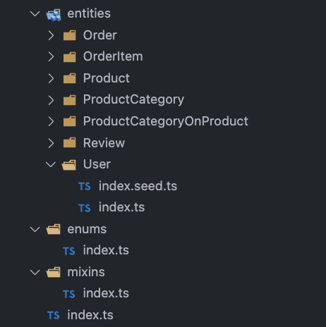
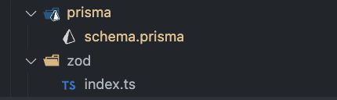

# Ormgen

-   Automatically solves 100% of the ORM generation problems in 95% of all projects.
-   Automatically solves 95% of the ORM generation problems in 3% of all projects.
-   Gives 0% kcuf about the remaining 2%.

# Quick explanation

Ormgen allows you to:

-   Define your entities in a file based system.
-   Generate anything you want from them - be it a prisma schema, types, zod or whatever you'd like.
    -   Use built-in generators or create your own.
-   Seed your database in with a per-entity way.

|       Your entities        | Generated files (examples)  |
| :------------------------: | :-------------------------: |
|  |  |

# Quick start

1. Install the `ormgen` package.
2. Run `ormgen init path/to/source`.
3. Run `ts-node index.ts` (or `ts-node` equivalent) to run generators.

Or check the `Example` section for a more detailed guide.

# Documentation

1. [Background](docs/2.background.md)
1. [Concepts](docs/3-0.Concepts.md) (WIP)
1. [Generators](docs/4.Generators.md) (WIP)
1. [Cli](docs/5.Cli.md) (WIP)
1. [Example](docs/10.Example.md)
1. [Todo & Roadmap](docs/10.Roadmap.md)
